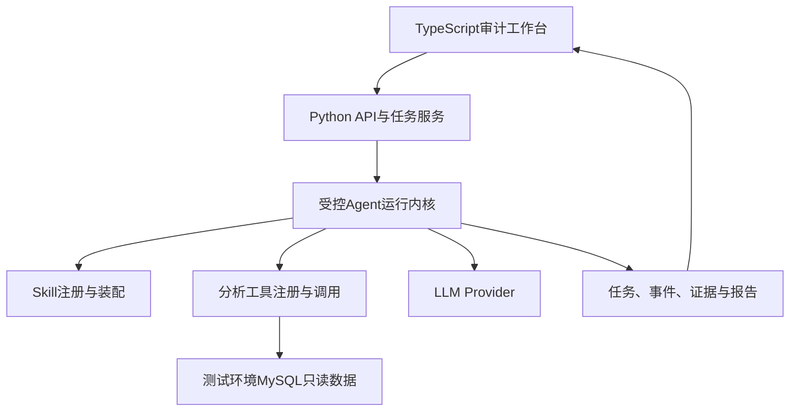

# Marketing Brain V0 DEMO 开发方案与开发计划

> 文档定位：用于指导“舆情分析策略大脑”V0 DEMO 的开发、测试、回归与验收。
>
> 核心原则：以真实数据和真实 LLM 跑通完整业务链路；采用轻量自研的受控 Agent Harness；每个 V0.x 都必须是可部署、可独立测试、可回归的里程碑版本。

## 1. V0目标与成功定义

### 1.1 核心业务场景

V0只验证一个标准场景：

> 针对指定汽车品牌、车型或话题，分析近期舆情发生了什么变化、哪些问题正在升温、可能由什么因素驱动、形成了哪些风险或机会，以及下一步应该监测、澄清、回应或继续验证什么。

标准任务输入包括：

- 分析对象：品牌、车型或话题；
- 当前分析周期与对比周期；
- 分析目标：常规舆情脉搏、异常问题排查或专题下钻；
- 本次运行的探索预算，例如最大子任务数、最大工具调用次数。

标准任务输出为“舆情策略包”，至少包括：

- 数据覆盖范围与样本说明；
- 总体声量及变化；
- 核心主题、升温问题和代表性传播来源；
- 风险、机会及其可能原因；
- 支撑证据、反例、不确定性和待验证假设；
- 建议采取的监测、澄清、回应或继续调查事项；
- 后续验证指标。

### 1.2 V0需要验证的产品假设

V0不是为了证明“LLM能够写舆情报告”，而是验证以下五项假设：

1. 主 Agent 能够把模糊问题拆解为合理、受控的调查计划；
2. 子 Agent 能够根据真实工具返回结果继续下钻，而不是机械执行固定步骤；
3. Skill 能够稳定约束分析方法、工具权限、证据要求和输出格式；
4. 结论能够追溯到真实统计结果、视频和评论，而不是只有自然语言判断；
5. 相比一次性 LLM 报告和固定分析流程，受控 Agent 在问题发现、证据完整性或策略价值上表现出可验证的增益。

### 1.3 V0完成标准

V0最终完成不等同于“Agent方案必须胜出”。以下结果都属于有效验证结论：

- **GO**：受控 Agent 有明确增益，可进入 V1；
- **ADJUST**：方向有效，但 Agent 自主范围、Skill 或工具设计需要调整；
- **STOP**：Agent 未体现足够价值，后续应优先采用固定流程或其他方案。

V0的真正交付成果，是一个能在测试环境稳定运行的系统，以及一份基于真实任务对照结果形成的明确结论。

## 2. 总体实施原则

### 2.1 架构原则

- **模块化单体**：V0只建设一个 Python 后端和一个 TypeScript 前端，不拆微服务；
- **确定性骨架＋有限自主探索**：程序控制阶段、预算、权限和停止条件，Agent决定调查路径；
- **数据计算与策略推理解耦**：程序负责统计和检索，Agent负责规划、解释、反证与综合判断；
- **证据优先**：关键判断必须绑定统计结果、视频ID或评论ID；
- **事件驱动审计**：保存结构化运行事件，不保存或展示模型的原始思维链；
- **接口稳定、实现从简**：通过自有协议隔离模型、数据源、工具、Skill和存储，V1可以替换实现而不重写业务流程。

### 2.2 轻量化约束

V0明确不引入以下重量级组件：

- LangGraph、AutoGen等 Agent 框架；
- Kafka、Flink、Celery等消息或分布式任务体系；
- Elasticsearch、ClickHouse、向量数据库和知识图谱；
- Kubernetes、微服务治理和分布式追踪平台；
- 重型前端组件库、低代码编排器和可视化插件市场。

若开发过程中确实需要新增重量级第三方件，必须单独说明必要性、替代方案和迁移影响，由项目负责人确认后方可引入。

## 3. 技术方案

### 3.1 技术栈

| 层级 | V0选型 | 说明 |
|---|---|---|
| 后端 | Python、FastAPI、Pydantic | API、任务执行、协议校验 |
| 数据访问 | SQLAlchemy＋轻量 MySQL Driver | 只读接入现有测试环境 MySQL；不允许 Agent 自由生成 SQL |
| LLM访问 | HTTP客户端＋自研 Model Provider | 优先支持 OpenAI-compatible API；通过 `.env` 切换地址、模型和密钥 |
| Agent运行 | 自研轻量状态机与 Agent Loop | 显式步骤、预算、停止条件、结构化输入输出 |
| 应用状态 | SQLite＋本地持久化卷 | 保存任务、事件、证据索引和结果；通过 Repository 接口为 V1 更换数据库留口 |
| 前端 | TypeScript、React、Vite | 不引入重型 UI 组件库和复杂状态管理框架 |
| 前后端通信 | REST＋定时轮询 | V0不建设 WebSocket 或消息推送体系 |
| 部署 | Docker、Docker Compose | 多阶段构建；测试环境以一个应用服务正式运行 |
| 测试 | Pytest、前端基础单测、Playwright或等价轻量E2E | 以关键业务链路和回归任务为主 |

### 3.2 最小运行架构

部署时由 Docker 多阶段构建 TypeScript 前端，将静态产物交给 Python 应用统一提供；Docker Compose 默认只启动一个应用服务，并挂载应用状态目录。这样既保留前后端代码边界，又减少测试环境部署组件。

### 3.3 自研轻量 Agent Harness

V0运行内核固定控制以下主流程：

其中：

- 主 Agent 负责规范任务、选择 Skill、生成调查卡、分派子任务和验收结果；
- 子 Agent 根据调查卡在授权工具范围内执行“提出假设—调用工具—检查证据缺口—继续下钻或停止”；
- 评审角色检查证据支撑、相反证据、样本偏差和结论越界；
- 三个角色可以使用同一个真实模型，通过不同 Prompt、Skill、上下文和输出协议形成逻辑隔离；
- 每个循环受最大子任务数、最大工具调用数、最大轮数和超时控制；
- 模型不直接连接数据库，不执行任意 SQL，不修改原始数据。

### 3.4 最小插件接口

V0只定义五类自有接口，不建设通用插件市场：

| 接口 | V0实现 | V1扩展方向 |
|---|---|---|
| DataSource | MySQL舆情数据适配器 | 其他数据库、文件、外部接口 |
| AnalysisTool | 固定参数的统计与证据查询工具 | 新业务工具、MCP包装 |
| Skill | 文件化舆情SOP和输出协议 | 经营诊断、竞品分析等新Skill |
| ModelProvider | OpenAI-compatible真实LLM API | 本地Qwen、其他云模型、路由策略 |
| EventStore | SQLite事件与结果存储 | MySQL/PostgreSQL、外部监控系统 |

插件接口只解决能力替换问题。预算控制、事件记录、证据绑定和质量门禁属于运行内核，不允许普通 Skill 绕过。

### 3.5 V0分析工具范围

第一版控制在约8个业务工具：

1. 数据覆盖与质量概览；
2. 声量时间趋势；
3. 当前周期与对比周期比较；
4. 高频词或候选主题验证；
5. 头部视频与传播来源查询；
6. 分层抽样的代表性评论检索；
7. 按关键词、时间、视频等条件下钻原始证据；
8. 品牌、车型或主题之间的基础比较。

每个工具必须返回查询条件、统计结果、样本量、时间范围、证据ID和必要的偏差提示。

V0不建设全量向量化和复杂主题聚类。主题分析采用轻量两阶段方案：先由分层样本和LLM发现候选主题及关键词，再由确定性查询在更大数据范围内验证规模和变化。系统必须在报告中说明这种方法可能遗漏隐含表达，不能把抽样结论包装成全量事实。

### 3.6 数据快照与证据链

V0采用“逻辑快照”，不复制几十万条原始数据：

- 创建任务时记录数据源、过滤条件、截止时间或最大数据ID；
- 本次运行的所有工具调用都自动附加相同快照边界；
- 统计证据保存查询条件、结果摘要和样本量；
- 文本证据保存原始 `comment_id`、关联 `video_id` 和必要文本快照；
- 关键判断、假设、风险和建议保存其引用的证据ID；
- 前端可从结论反查证据，也可从证据查看其支撑的结论。

这能够保证一次运行内部口径一致，同时避免为V0建设独立数仓或对象存储。

### 3.7 审计事件

V0至少记录以下结构化事件：

- 任务创建和快照建立；
- Skill选择与计划生成；
- 子任务派发、开始、完成和停止原因；
- 模型请求摘要、响应状态、Token和耗时；
- 工具名称、参数摘要、返回摘要和错误；
- 证据登记；
- 假设新增、更新或否定；
- 评审结果和补充调查要求；
- 报告生成、任务完成或失败。

审计对象是“计划、动作、证据、结构化判断与状态变化”，不是模型不可验证的原始思维链。

### 3.8 前端审计工作台

前端采用一个工作台、三个主要视图：

1. **任务视图**：创建任务，查看历史任务、状态、耗时、Token、工具调用数和最终结论；
2. **运行审计视图**：以阶段时间线＋主子任务树展示计划、Skill、工具调用、模型调用、循环轮数、停止原因和错误；
3. **报告与证据视图**：展示舆情策略包，点击结论可查看统计证据、代表评论、视频来源、反例和不确定性。

运行中的任务通过2—3秒轮询刷新状态。V0不做拖拽编排、自定义仪表盘、复杂图表平台、用户权限和多租户。

## 4. V0.x版本开发计划

### 4.1 版本总览

| 版本 | 里程碑目标 | 可验收交付成果 | 估算工作量* |
|---|---|---|---|
| V0.1 | 真实环境与数据链路跑通 | 可部署骨架、真实MySQL读取、数据概览页面 | 2—3人日 |
| V0.2 | 建立非Agent基线 | 真实LLM生成固定流程舆情报告、基础证据引用 | 3—4人日 |
| V0.3 | 建立受控工作流与Skill机制 | 分阶段流程、Skill装配、事件流、可回放运行 | 4—5人日 |
| V0.4 | 加入主Agent与子Agent Loop | 动态调查计划、有限下钻、预算与独立评审 | 5—7人日 |
| V0.5 | 完成审计可视化工作台 | 任务、运行链路、报告与证据的完整可视化 | 4—5人日 |
| V0.6 | 对照验证与正式验收 | 测试环境发布、回归集、对照报告、GO/ADJUST/STOP结论 | 3—4人日 |

\* 工作量为单人等效估算，不包含等待测试环境账号、数据口径确认和业务专家评审的时间。整体约21—28人日。

### 4.2 V0.1：真实环境与数据链路

**版本目标**

证明项目能够通过 Docker Compose 在测试环境运行，并正确读取真实 MySQL 舆情数据。

**开发范围**

- 建立 Python 后端、TypeScript 前端和 Docker Compose 工程骨架；
- 完成 `.env` 配置加载与 `.env.example`；
- 接入测试环境 MySQL 只读账号；
- 根据真实视频表、评论表完成 DataSource 适配；
- 实现健康检查、数据源连通性检查和数据覆盖概览接口；
- 前端提供最小任务入口和数据概览页；
- 建立自动化测试命令和版本发布检查清单。

**交付成果**

- 可构建、可启动的完整代码；
- `docker compose up -d --build` 可运行的部署包；
- `.env.example` 与测试环境配置说明；
- 数据源适配器和首个数据概览工具；
- 可视化数据概览页面；
- V0.1测试报告。

**验收标准**

1. 测试服务器仅通过 `.env` 配置即可成功启动；
2. 健康检查能够分别显示应用和MySQL状态；
3. 页面可选择或输入一个真实品牌/车型/话题及时间范围；
4. 页面返回的视频数、评论数、时间范围与人工SQL抽查结果一致；
5. 应用重启后仍可正常运行；
6. 不依赖开发者本机文件、硬编码账号或模拟数据。

**回归重点**

- Compose构建与启动；
- `.env`缺项提示；
- MySQL连接失败提示；
- 查询条件和统计数量正确性。

### 4.3 V0.2：非Agent基线版本

**版本目标**

使用真实数据库和真实 LLM API 跑通“固定分析流程→舆情报告”的端到端链路，为后续 Agent 对照验证建立基线。

**开发范围**

- 接入 OpenAI-compatible 真实 LLM API；
- 实现逻辑数据快照；
- 实现核心统计、对比、代表视频和评论抽样工具；
- 采用固定顺序执行数据查询；
- 将结构化分析结果交给LLM生成基线舆情报告；
- 保存任务、报告、Token、耗时和基础证据引用；
- 前端支持创建任务、查看运行状态和基线报告。

**交付成果**

- 可配置真实模型的 Model Provider；
- 非Agent固定分析流水线；
- 基线舆情报告页；
- 任务与报告持久化；
- 真实LLM冒烟测试和V0.2测试报告。

**验收标准**

1. 从前端提交一个真实分析任务后，无需人工介入即可完成；
2. 报告至少包含数据范围、总体变化、核心讨论、代表证据和初步建议；
3. 报告引用的评论ID和视频ID可在数据库中查到；
4. 同一任务的所有查询使用相同快照边界；
5. 页面显示模型、Token、耗时和成功/失败状态；
6. 关闭并重启容器后，历史任务和报告仍可查看。

**回归重点**

- 真实模型调用和结构化输出解析；
- 快照一致性；
- 证据ID有效性；
- 失败任务能够保留错误信息而不产生伪报告。

### 4.4 V0.3：受控工作流与Skill版本

**版本目标**

把固定流水线升级为可审计的分阶段工作流，验证 Skill 能够在不修改运行内核的情况下约束分析SOP。

**开发范围**

- 实现自研轻量状态机；
- 固定“快照—计划—调查—评审—综合—完成”阶段；
- 定义 Skill 文件格式、加载器、版本和校验机制；
- 首批实现 `opinion-pulse`、`evidence-review`、`strategy-synthesis` 三个Skill；
- 建立 AnalysisTool 注册机制和工具权限白名单；
- 建立追加式运行事件；
- 建立证据、判断、假设、策略建议之间的引用关系；
- 前端增加基础运行时间线。

**交付成果**

- 可恢复状态的受控工作流内核；
- Skill加载与装配能力；
- 工具注册、授权和统一返回协议；
- 完整运行事件记录；
- 基础时间线页面；
- V0.3接口契约测试和回归报告。

**验收标准**

1. 同一任务能够按固定阶段完成，任何阶段不得被LLM绕过；
2. 更换Skill版本后无需修改运行内核即可改变分析要求；
3. 未经Skill授权的工具不能被调用；
4. 任一关键结论至少关联一项证据，或明确标记为“待验证假设”；
5. 从运行事件能够重建阶段顺序、工具调用、状态变化和最终结果；
6. 任务中断或失败后，已完成阶段和事件不会丢失。

**回归重点**

- 状态转移合法性；
- Skill装配和版本记录；
- 工具权限；
- 事件顺序；
- 证据引用完整性。

### 4.5 V0.4：主Agent与受控子Agent Loop

**版本目标**

实现V0最核心的 Agent 验证能力：主 Agent 自主规划和监督，子 Agent 在边界内进行有限探索，并由独立评审角色检查结论。

**开发范围**

- 主 Agent 将任务拆分为结构化调查卡；
- 子 Agent 根据工具结果动态选择下一步；
- 支持假设新增、证据补充、假设否定和继续下钻；
- 实现最大子任务数、最大轮数、最大工具调用数、超时等预算；
- 实现证据充分、数据不足、预算耗尽、工具失败等停止原因；
- 实现独立评审角色及一次受控补充调查；
- 实现非法模型输出修复或明确失败，不静默吞错；
- 前端显示主计划、子任务进度和停止原因。

**交付成果**

- Supervisor、Investigator、Reviewer三个逻辑角色；
- 结构化调查卡和调查结果协议；
- 可控Agent Loop；
- 预算、停止条件和评审门禁；
- 至少一个能触发动态下钻的真实案例；
- V0.4 Agent行为测试和回归报告。

**验收标准**

1. 主 Agent 能针对真实任务生成多个有明确目标和证据要求的调查卡；
2. 子 Agent 至少能在一个验收案例中根据首轮工具结果决定新的下钻查询；
3. 所有工具调用均处于授权范围且不超过预算；
4. 达到证据充分、数据不足或预算耗尽时能够明确停止；
5. 评审角色能指出至少一类证据不足、反例或样本偏差，并决定通过或要求一次补查；
6. 最终报告能够区分事实、解释性判断和待验证假设；
7. V0.2基线任务仍可通过同一系统运行，用于后续对照。

**回归重点**

- 计划结构化解析；
- Loop不会无限运行；
- 预算硬限制；
- 动态下钻事件；
- 评审门禁；
- LLM格式异常和工具异常处理。

### 4.6 V0.5：完整审计可视化工作台

**版本目标**

让业务人员和开发人员不查看后台日志，也能理解一次策略任务“如何规划、查了什么、依据什么、为何得出结论”。

**开发范围**

- 完成任务列表与筛选；
- 完成任务创建和参数配置；
- 完成阶段时间线、主子任务树和实时状态轮询；
- 展示Skill版本、模型、Token、耗时、工具调用和停止原因；
- 展示工具输入摘要和返回摘要；
- 建立结论—证据双向查看；
- 完成舆情策略包的结构化报告页面；
- 支持失败任务定位和基础原始JSON查看。

**交付成果**

- 可供非开发人员使用的完整审计工作台；
- 任务、轨迹、证据、报告三类核心视图；
- 运行中状态刷新；
- V0.5前端E2E测试与回归报告。

**验收标准**

1. 用户可在页面完成任务创建、运行观察和结果查看；
2. 页面能够完整展示主 Agent 计划、子任务、工具调用、评审和综合阶段；
3. 点击一项关键结论可查看其统计或原始评论证据；
4. 点击一项证据可看到其被哪些判断引用；
5. 页面明确展示反例、不确定性、停止原因和失败位置；
6. 不依赖后端日志即可完成一次任务审计；
7. V0.1—V0.4核心回归用例全部通过。

**回归重点**

- 前端主流程E2E；
- 运行中和已完成状态展示；
- 证据链接正确性；
- 历史任务兼容；
- 大量事件下页面仍可正常使用，不设生产级性能指标。

### 4.7 V0.6：对照验证与测试环境正式验收

**版本目标**

在测试环境发布完整V0，使用真实数据和真实LLM完成对照评测，形成是否进入V1的决策依据。

**开发范围**

- 固化测试环境部署与升级流程；
- 建立5—10个真实历史舆情任务组成的最小回归集；
- 对比“一次性LLM报告、固定流程、受控Agent流程”三种模式；
- 建立轻量人工评分表；
- 修复阻断主链路的问题；
- 完成版本说明、操作说明和最终验收记录。

**交付成果**

- 测试环境正式运行的V0系统；
- Docker Compose发布包和`.env.example`；
- 最小回归任务集；
- 三种模式的对照结果；
- V0验收报告；
- 明确的GO、ADJUST或STOP结论及V1建议。

**验收标准**

1. 全新测试服务器根据文档可完成部署和启动；
2. 系统真实连接指定LLM API和测试环境MySQL，核心链路不存在模拟实现；
3. 至少5个真实任务完成三种模式对照，其中至少包含一个异常升温案例和一个数据不足案例；
4. 所有成功任务均可从最终关键结论追溯到有效证据；
5. 预算限制、停止条件、失败记录和历史回放可验证；
6. 业务专家可依据统一评分表完成评价；
7. 无阻断任务创建、运行、审计和报告查看的缺陷；
8. 最终结论明确说明Agent的增益、代价、主要缺陷和是否值得进入V1。

**建议评分维度**

- 重要问题发现完整性；
- 证据准确性与覆盖率；
- 反证和不确定性处理；
- 风险/机会判断合理性；
- 策略建议可执行性；
- 多次运行一致性；
- Token、耗时和工具调用成本。

## 5. 环境配置与部署要求

### 5.1 `.env`配置范围

实际变量名称可在开发时统一，但至少覆盖：

- 应用运行环境、端口和日志级别；
- 应用状态数据库地址或持久化目录；
- MySQL主机、端口、数据库、只读用户名、密码和字符集；
- 视频表、评论表或数据适配配置入口；
- LLM API Base URL、API Key、模型名称、超时；
- 默认Skill/Profile；
- 最大子任务数、最大Loop轮数、最大工具调用数；
- 单次工具最大返回记录数；
- 前端轮询间隔等少量运行参数。

仓库只提交 `.env.example`，实际 `.env` 由测试环境配置，不进入版本库。V0不建设配置中心或密钥管理平台。

### 5.2 Docker Compose要求

- 使用多阶段构建完成前端编译和后端运行镜像；
- 默认只包含一个应用服务及一个本地持久化卷；
- 不在Compose中复制搭建测试MySQL，直接连接指定测试环境数据库；
- 提供健康检查；
- 提供统一的启动、停止、查看日志和升级命令；
- 容器重建后历史任务数据不丢失；
- 不依赖宿主机已安装Python或Node.js。

## 6. 测试与回归策略

### 6.1 四层测试

| 层级 | 主要内容 | 执行频率 |
|---|---|---|
| 单元测试 | 状态流转、预算、Skill校验、工具协议、证据引用、LLM输出解析 | 每次提交 |
| 集成测试 | MySQL查询、应用存储、真实LLM冒烟、任务执行 | 每个版本 |
| E2E测试 | 页面创建任务、观察运行、查看报告和证据 | V0.2起每个版本 |
| 业务回归 | 固定历史舆情任务和人工评分 | V0.4起，V0.6正式执行 |

真实LLM调用具有成本和非确定性：普通代码回归可使用录制响应或受控Stub测试协议，但每个里程碑验收必须至少执行一次真实LLM冒烟；V0.6必须全部使用指定真实模型完成正式对照。

### 6.2 每个版本统一Definition of Done

一个V0.x只有同时满足以下条件才可标记完成：

1. 代码、配置样例和必要说明已提交；
2. 可通过Docker Compose在测试环境部署；
3. 本版本验收用例全部通过；
4. 既有版本核心回归用例通过；
5. 页面能够查看本版本产生的结果或审计信息；
6. 已记录已知问题，且不存在阻断核心链路的问题；
7. 形成版本测试报告和可复现的验收任务。

## 7. 开发前置条件

V0.1开始前需要一次性准备：

- 测试环境MySQL只读账号和网络连通性；
- 视频表、评论表结构及品牌、车型、发布时间等关键字段说明；
- 3—5条人工SQL及结果，用于校验数据口径；
- 可用的真实LLM API地址、密钥、模型名和调用格式；
- 一台支持Docker Compose的测试服务器；
- 5—10个可用于最终对照的真实舆情任务，以及至少一名业务验收人员。

若真实数据字段与预期差异较大，只调整DataSource适配器，不修改Agent运行内核和业务协议。

## 8. V0明确不做

- 实时全网数据采集和流式舆情预警；
- 任意数据库的可视化接入配置；
- Agent自由生成或执行SQL；
- 动态创建任意Agent或多Agent自由群聊；
- 自动发布内容、自动回应舆情或自动执行营销动作；
- 自动写入长期经验库和自主进化；
- 完整MCP化、插件市场和拖拽式Skill编排；
- 全量向量化、复杂主题模型、知识图谱和因果归因；
- 多租户、复杂权限、生产级高可用和性能优化；
- 移动端适配、精细视觉设计和非核心报表。

## 9. 进入V1前的决策门

V0.6评审时只回答四个问题：

1. 受控Agent是否比固定流程发现了更多重要问题，或形成了更可靠的策略判断？
2. 这种增益是否足以覆盖额外的Token、耗时、不稳定性和维护成本？
3. 当前最应扩展的是数据工具、Skill、Agent自主范围，还是业务场景？
4. 哪些V0接口已经被验证稳定，哪些必须在V1前重构？

在回答这些问题之前，不提前建设长期记忆、复杂多Agent、完整插件生态或生产级平台能力。

---

**V0技术定义**

> Marketing Brain V0 是一套面向汽车舆情分析的轻量受控 Agent Harness：以真实MySQL数据和确定性分析工具为基础，以主Agent进行规划监督、子Agent开展有限证据探索、Skill定义专业SOP，并通过可视化事件链实现全过程审计和对照验证。
