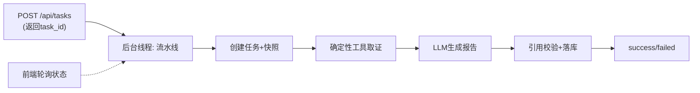

# Marketing Brain V0.2 设计文档（非 Agent 基线版本）

> 文档定位：V0.2 阶段的需求澄清与实现设计。开发任务期间的临时产出，
> 用于指导「固定分析流程 → 舆情报告」端到端链路的实现、测试与验收。
> 稳定的系统级架构见 `docs/architecture.md`；长期运行原理见 `docs/how-it-works.md`。
>
> 范围：本稿只覆盖 V0.2 已确定落地的内容。分阶段状态机、Skill 机制、
> Agent Loop、评审角色、完整审计工作台等留待 V0.3+，不在本稿设计。

## 1. 版本目标

V0.2 用真实数据库和真实 LLM API 跑通「固定分析流程 → 舆情报告」端到端链路，
为后续 V0.4 的 Agent 对照验证建立非 Agent 基线。

**验证重点（本版负责）**：

- 真实 LLM 接入与结构化输出解析；
- 逻辑数据快照在多次查询间口径一致；
- 确定性统计工具返回可溯源的数据；
- 报告引用的证据 ID（comment_id / video_id）能在证据库回查；
- 任务、报告、Token、耗时、状态能持久化并在前端查看。

## 2. 关键数据口径决策（已实测确认）

V0.2 的统计正确性依赖以下口径。这些结论来自对测试环境 MySQL 的实际探测，
不是设计阶段的假设。

### 2.1 时间锚点：作业 `created_at`（UTC）

- 舆情时间维度统一使用 `api_job.created_at`（UTC），**不用**评论自带时间。
- 实测理由：展开评论的 `comment_time` 不可靠——最早可到 2023 年、最晚甚至晚于
  所属作业的创建时间。用 `created_at` 分桶才能保证口径稳定、可复现。
- 当前与对比周期的窗口边界（start/end）都按 `created_at` 计算。

### 2.2 对象匹配：话题标签，而非标题子串

- 分析对象（品牌/车型/话题）按 `video_title` 中的 **`#话题标签`** 匹配，不是
  标题子串 `LIKE`。
- 实测理由：纯子串匹配会把竞品对比视频误算进品牌声量。例如近 30 天含「坦克300」
  的标题命中 74,922 条，但其中只有 21,179 条实际带 `#坦克300` 标签——其余是
  「兰德酷路泽vs坦克300」这类对比内容，属于噪音。
- 标签形态稳定、覆盖度高：含「坦克」的标题里 144,029 / 146,552 带 `#` 标签。
- 匹配表达式：`video_title LIKE '%#{object}#%'`（对象前后紧贴 `#`）。

### 2.3 视频（来源）标识：`api_job.id`

- `api_job` 一行对应一次抓取作业；V0 中一条「视频」的粒度即一次作业。
- 因此溯源用的 `video_id` 取 `job.id`，评论的 `comment_id` 取展开后的 `comment_id`。
- 报告里引用的来源，统一指向 `job.id` + 该作业的 `video_title` / `video_author`。

### 2.4 数据规模基线

- 成功作业 56,156 个，累计展开评论 861,760 条。
- 时间窗口 2026-07-24 至 2026-09-04（持续累积）。

## 3. 架构与执行模型

沿用 V0.1 的模块化单体分层（api / understanding / snapshot / datasource / store / core），
V0.2 在其上新增 `llm`、`analysis`、`pipeline` 三个子模块，不改既有模块的对外接口。

### 3.1 执行模型：后台异步 + 前端轮询

- `POST /api/tasks` 创建任务后立即返回 `task_id`，不阻塞请求。
- 任务在后台线程驱动流水线执行，状态流转 `pending → running → success/failed`。
- 前端按 `UI_POLL_INTERVAL_MS`（默认 2500ms）轮询 `GET /api/tasks?task_id=` 刷新状态。
- 失败任务保留错误信息，**不生成伪报告**。



## 4. 新增模块设计

### 4.1 LLM Provider（`app/llm/provider.py`）

- 用 `httpx` 直连 OpenAI-compatible API，**不引入 openai SDK**。
- 配置来自 `.env` 的 `LLM_API_BASE` / `LLM_API_KEY` / `LLM_MODEL`。
- 核心方法：
  - `chat(messages, *, json_mode=False, max_tokens=None)`：调用模型，返回文本。
  - `chat_json(...)`：请求 `response_format=json_object`，解析并校验为 JSON，失败抛清晰异常。
- 每次调用返回结构化摘要：模型名、输入/输出 token、耗时（供任务记录与前端展示）。
- LLM 调用抽象为接口，便于测试时用录制响应 stub 替换（见 §7 测试）。

### 4.2 分析工具集（`app/analysis/tools.py`）

确定性统计工具集合，**所有工具自动附加快照边界**（时间窗 + 对象标签），
保证一次运行口径一致。每个工具返回：查询条件、统计结果、样本量、时间范围、
证据 ID 与必要的偏差提示。V0.2 首批实现约 8 个：

1. 数据覆盖与质量概览（命中条数、作业数、时间范围）；
2. 当前周期声量时间趋势（按天/周分桶）；
3. 当前周期 vs 对比周期比较（总量、变化率）；
4. 高频词 / 候选主题验证（评论词频统计，供 LLM 归纳主题）；
5. 头部视频与传播来源查询（Top 作业/标题，按评论量、点赞量）；
6. 分层抽样的代表性评论检索（可带关键词过滤、按点赞/是否车主/购买意向分层）；
7. 按关键词/时间/视频等条件下钻原始证据；
8. 品牌、车型或主题之间的基础比较。

V0.2 只做一阶段：**LLM 从统计结果与抽样评论内归纳主题**，不做两阶段候选主题验证
（后者接近 V0.3/V0.4 能力，本轮不做）。

### 4.3 固定流水线（`app/pipeline/baseline.py`）

固定顺序执行，不做任何 LLM 自主规划：

```text
① 数据范围与质量概览
② 总体声量及变化（当前 vs 对比）
③ 核心主题与升温问题（由 LLM 从抽样归纳）
④ 代表性传播来源
⑤ 风险、机会、建议、待验证假设
```

每一步产出结构化中间结果，累积为 `AnalysisBundle`，作为 LLM 报告生成的输入。

### 4.4 报告生成（`app/llm/report.py`）

- 将上面结构化中间结果整理成上下文（含抽样评论、统计数字、证据 ID）。
- 调用一次 LLM，按固定输出协议生成「舆情策略包」JSON。
- 输出协议字段（完整策略包，作为后续版本契约打底）：

| 字段组 | 内容 | 证据要求 |
|---|---|---|
| `scope` | 数据覆盖范围与样本说明 | 引用统计、样本量、时间窗 |
| `overall` | 总体声量及变化 | 当前/对比总量与变化率 |
| `themes` | 核心主题、升温问题 | 每个主题绑定代表评论 ID |
| `sources` | 代表性传播来源 | 绑定 job_id / video_title |
| `risk_opportunity` | 风险、机会及其可能原因 | 结论绑定证据 |
| `evidence_gaps` | 支撑证据、反例、不确定性 | 无需绑定、明示缺口 |
| `assumptions` | 待验证假设 | 明示为假设，非事实 |
| `actions` | 监测、澄清、回应、继续调查事项 | 指向具体证据/主题 |
| `metrics` | 后续验证指标 | 量化、可回查 |

### 4.5 证据引用校验（`app/pipeline/verify.py`）

- 流水线取证阶段把所有命中 `comment_id` / `job_id` 登记进本次运行的证据库。
- 报告生成后，提取报告引用的证据 ID，逐一核对是否在证据库中。
- 合法引用保留；找不到的 **非法 ID 剔除**，并在报告中标记「该引用未通过校验」。
- 这一步杜绝 LLM 幻觉出不存在的 ID，保证「报告引用的评论/视频 ID 可在数据库中查到」。

### 4.6 证据库（`app/store/evidence.py`）

- 本次运行内维护的证据索引：`comment_id`、`job_id`、评论文本快照、视频标题、
  来源与统计摘要。
- 供引用校验与前端「结论 → 证据」回查使用。
- 与 V0.1 的 `EventRepository` 衔接：每阶段仍写追加式审计事件。

### 4.7 任务执行器（`app/pipeline/runner.py`）

- 用标准库 `threading` 实现后台执行（V0 不引入 Celery/消息队列）。
- 编排：创建任务→取证→LLM→校验→落库→标记成功/失败。
- 全程写事件（阶段开始/完成、工具调用、token、耗时、错误），失败保留错误。

## 5. 前后端契约变更

### 5.1 后端 API

- `POST /api/tasks`：创建后**立即启动后台执行**，返回任务（status=running）。
- `GET /api/tasks?task_id=`：返回任务状态、进度、token/耗时、结果。
- `GET /api/tasks/list`：返回任务列表，含状态与结果概要。
- 新增 `GET /api/tasks/{id}/report`：返回该任务的舆情策略包（若成功）。
- 新增 `GET /api/tasks/{id}/evidence`：返回证据索引列表。
- 既有 `GET /api/health`、`GET /api/data-overview` 不变。

### 5.2 前端

- 任务卡片：显示运行状态、模型、Token、耗时、成功/失败。
- 新增**基线报告视图**：点击任务进入，展示舆情策略包（范围、总体变化、核心主题、
  代表证据来源、风险机会、证据缺口、待验证假设、建议、验证指标）。
- 点击报告中的证据引用，可查看对应评论文本与来源。
- 运行中任务按 `UI_POLL_INTERVAL_MS` 轮询刷新状态。
- 沿用轻量 React（Vite），不引入重状态管理。

## 6. 数据快照与口径一致性

- 创建任务时经意图识别得到分析对象与时间范围，构建 `LogicalSnapshot`。
- 快照附加：`start_time`/`end_time`（基于 `job.created_at`）、`extra.video_tags`（对象标签）。
- 流水线所有工具查询统一调用 `snapshot.attach_query_params()` 附加同一边界。
- 对比周期由程序确定性计算（当前窗口等长的前一周期），非 LLM 决定。
- 目的：一次运行内部口径一致，且各次运行之间可复现。

## 7. 测试与验证策略

| 层级 | 内容 | 说明 |
|---|---|---|
| 单元 | 流水线阶段顺序、快照附加、引用校验剔除非法 ID、token/耗时统计 | LLM 用录制响应 stub，不连真实 API |
| 集成 | 真实 MySQL 的 8 个工具查询正确性 | `-m integration` 标记 |
| 冒烟 | **1 次真实 LLM 调用**生成报告并校验引用 | 按约定：执行前先告知 |
| 回归 | V0.1 的 40 个测试保持全绿 |

**定义完成（Definition of Done）**：

1. 代码、`.env.example` 补充、必要说明已提交；
2. 可通过 Docker Compose 在测试环境部署；
3. 本版验收用例全部通过；V0.1 回归全绿；
4. 前端可创建任务、查看运行状态与基线报告；
5. 报告引用的评论/视频 ID 可在证据库回查到；
6. 失败任务保留错误信息，不产生伪报告；
7. 已记录已知问题，无阻断核心链路缺陷。

## 8. 本版明确不做（留待 V0.3+）

- 分阶段状态机、可恢复的受控工作流；
- Skill 文件格式、加载器与权限；
- 主 Agent / 子 Agent Loop、动态下钻、评审角色；
- 完整审计时间线可视化；
- 全量向量化、复杂主题聚类（V0.2 只做一次调用内 LLM 归纳）。
