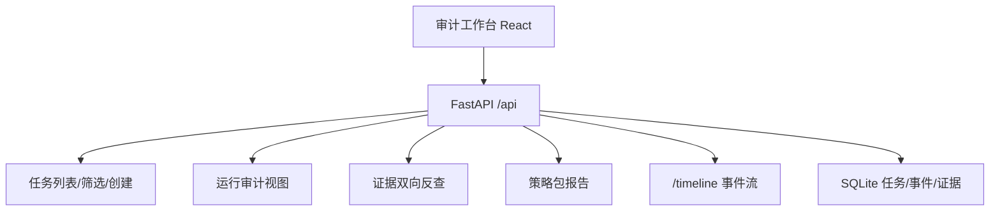

# V0.5 + V0.6 审计工作台设计（编码部分）

> 文档定位：V0.5 完整审计可视化工作台 + V0.6 可编码部分的实现设计。
> 读者：主 Agent 与开发人员。本文档只写意图、契约与取舍，不重复代码实现细节。

## 1. 版本目标与范围

### 1.1 V0.5 目标

让业务人员与开发人员**不查看后台日志**，也能理解一次策略任务「如何规划、查了什么、依据什么、为何得出结论」。

### 1.2 V0.6 编码部分目标

在测试环境发布完整 V0 之前，先完成可代码化的对照与验收基建：三种模式（一次性 LLM 报告 / 固定流程 / 受控 Agent）的对照跑通、评分表、最小回归任务集脚本与验收文档。**正式对照、人工评分与 GO/ADJUST/STOP 结论**依赖测试环境账号与业务评审，属执行者现场工作，不在本次代码交付内。

### 1.3 本次交付边界

| 内容 | 是否本次交付 |
|---|---|
| V0.5 完整审计工作台（任务列表/筛选、创建配置、主子任务树、工具输入/返回摘要、结论↔证据双向反查、策略包报告、原始 JSON） | 是 |
| 后端小增强：`subtask_tool` 事件补记工具返回摘要 | 是 |
| V0.6 一次性 LLM 报告种子基线（`oneshot` 模式） | 是 |
| V0.6 评分表、最小回归任务集脚本、验收模板 | 是 |
| 测试环境部署、真实三模式对照跑取、人工评分、GO/ADJUST/STOP 结论 | 否（现场执行） |

## 2. 设计原则

- **前端纯消费、后端只做最小增强**：结论↔证据双向反查所需数据已存在于现有契约（报告含 `evidence_refs`，证据含 `referenced_by`），前端无需新接口。唯一后端改动是 `subtask_tool` 事件补记工具返回摘要，这是验收标准「展示工具输入/返回摘要」的直接要求。
- **沿用现有 UI 范式**：无 UI 组件库、无状态管理框架，继续用轻量 React 函数组件 + CSS。结构清晰优先，不引重型框架。
- **三模式并存、互不侵入**：V0.2 基线、V0.3 工作流、V0.4 Agent、V0.6 一次性报告并存，通过开关/模式参数切换，不破坏既有回归。
- **一次性报告是独立最小流水线**：与 V0.2 固定流程复用取数与证据采样，但报告由单次 LLM 生成（无分阶段、无子 Agent 下钻），构成「非 Agent 非固定」的对照基线。

## 3. 架构与数据流



本次新增/改动的前端视图：

1. **任务列表与筛选**：按状态（pending/running/success/failed）筛选、按 Skill/模式标签展示。
2. **任务创建配置**：增加可选参数（`max_subtasks`、`max_tool_calls`、运行模式），默认在 UI 隐藏，仅高级展开。
3. **运行审计视图**：阶段时间线 + 主子任务树 + 工具输入/返回摘要 + 模型/token/耗时 + 停止原因 + 失败定位。
4. **证据双向反查**：点结论看其引用证据；点证据看其被哪些判断引用。
5. **策略包报告视图**：结构化展示事实层、解释性判断、待验证假设、风险机会、行动建议。
6. **原始 JSON 查看**：失败任务定位 + 任意任务结果原始 JSON 折叠查看。

## 4. 后端改动（最小）

### 4.1 `subtask_tool` 事件补记工具返回摘要

**现状**：`app/agent/investigator.py` 的 `_execute_tool` 在 `subtask_tool` 事件中只记录 `arguments` 与 `sample_size`，未记录工具返回摘要。

**改动**：在 `_execute_tool` 的 `subtask_tool` 事件 payload 中追加 `result_summary`（工具返回的**紧凑可读摘要**）与 `bias_note`。关键约束：**事件只存紧凑摘要标量，不存全量返回 dict**——抽样评论/趋势等大 results 不整包写进事件（这是 V0.4 审计"事件留摘要"的既定原则），完整版留在证据库供前端反查。

`result_summary` 的形态按工具类型压缩为短文本或标量 dict，例如：
- `data_coverage` / `volume_trend` / `period_comparison`：保留 `comment_count`/`total` 等标量；
- `sample_comments` / `drill_evidence`：保留 `sample_size` 计数与代表性摘要，不整包存评论列表；
- `topic_frequency_tool`：保留命中主题数与前几个主题标题。

```python
self.event_repo.append_event(task_id, "subtask_tool", {
    "card_id": card.card_id, "tool": tool_name, "arguments": coerced,
    "sample_size": res.get("sample_size", 0),
    "result_summary": _tool_result_summary(res),  # 新增：紧凑摘要
    "bias_note": res.get("bias_note", ""),         # 新增：偏差提示
})
```

`_tool_result_summary(res)` 是一个新加的工具函数，从 `res["result"]` 提取标量/短文本，默认回退为 `{"sample_size": res.get("sample_size")}`，避免事件膨胀。

### 4.2 一次性 LLM 报告种子基线（`oneshot` 模式）

**新增最小流水线** `app/pipeline/oneshot.py`：

- 与 V0.2 基线复用 `BaselinePipeline` 取数（数据覆盖、声量趋势、周期对比、主题、来源、抽样评论）；不需要分阶段、不需要子 Agent 下钻。
- 将数据概要 + 抽样结果一次性喂给真实 LLM，生成「一次性 LLM 报告」——与固定流程（V0.2）的区别是**报告由单次 LLM 生成**而非分阶段综合，与受控 Agent（V0.4）的区别是**无子 Agent 探索**。
- 输出沿用三层报告 + 证据结构，`result` 中带 `mode: "oneshot"`，供前端与评分表辨识。

**路由接入**：`CreateTaskRequest` 增加可选 `mode` 字段（`"agent" / "workflow" / "baseline" / "oneshot"`，默认按现有开关决定）。`mode="oneshot"` 时走 oneshot 流水线，其余照旧。

**配置**：复用现有 `.env` 与 Model Provider，不新增依赖。

> 注：`mode` 参数仅作显式覆盖。未指定时仍遵循 `ENABLE_AGENT_ENGINE`/`ENABLE_WORKFLOW_ENGINE` 开关，保持向后兼容。

## 5. 前端改动

### 5.1 项目结构调整

现有 `App.jsx`（约 426 行，单文件）承担了数据概览、任务创建、历史列表、基线报告、Timeline、AgentPlan 六块职责。为 V0.5 审计工作台做**结构拆分**（为新增视图做准备——把 App.jsx 中职责抽到多文件，**不改动现有组件内部逻辑与产物**，不引入路由/状态管理框架）：

```
page/src/
  App.jsx            # 应用壳：数据概览 + 任务创建 + 任务列表/筛选 + 视图切换
  AuditWorkbench.jsx # 运行审计视图（主子任务树 + 工具摘要 + 模型/token/停止原因）
  ReportView.jsx     # 策略包报告（结论↔证据双向反查）
  EvidencePanel.jsx  # 证据双向反查面板
  RawJson.jsx        # 原始 JSON 折叠查看
  Timeline.jsx       # 现有阶段时间线（保留）
  AgentPlan.jsx      # 现有调查计划/子任务/评审/预算（保留）
```

拆分原则：每个文件一个清晰职责、可独立测试；不重写现有组件逻辑，只把 App.jsx 中的职责抽到对应文件。

### 5.2 关键实现点

- **任务筛选**：前端按 `status` 过滤（pending/running/success/failed），无需后端改动。
- **主子任务树**：消费 `/timeline` 事件，构建「调查卡 → 子任务工具调用」树；展示每卡停止原因、工具调用数。
- **工具输入/返回摘要**：从 `/timeline` 的 `subtask_tool` 事件读取 `arguments`（输入摘要）与新补记的 `result_summary`/`bias_note`（返回摘要）。**依赖后端 4.1 改动；旧任务事件无该字段时优雅降级（仅显参数），不报错。**
- **结论↔证据双向反查**：从 `/report` 的 `evidence_refs`（判断→证据）与 `/evidence` 的 `referenced_by`（证据→判断）构建双向映射。纯前端消费，不加接口。
- **策略包报告**：结构化展示三层报告（事实/判断/假设）与风险机会、行动建议；引用处可点击展开证据。
- **原始 JSON**：任务详情提供折叠查看 `result` 原始 JSON，失败任务定位错误。

### 5.3 前端测试

- 组件单测（`vitest`）：筛选逻辑、主子任务树构建、双向映射构建、降级处理。
- E2E（现有 Playwright 或等价）：创建任务 → 观察运行 → 查看报告与证据 → 点击结论/证据反查。

## 6. V0.6 验收基建

### 6.1 三种模式对照

- **一次性 LLM 报告**（新增，`oneshot`）
- **固定流程**（V0.2 基线）
- **受控 Agent**（V0.4）

三者对同一真实任务跑同一数据快照，产出可对比报告。为减少 LLM 成本，评分表与对照集中在选定的 5—10 个真实任务上。

### 6.2 人工评分表

`docs/specs/2026-09-09-v06-scoring-rubric.md`：按计划文档建议的维度（重要问题发现完整性、证据准确性与覆盖率、反证与不确定性处理、风险/机会判断合理性、策略建议可执行性、多次运行一致性、Token/耗时/工具调用成本）建立 1—5 分评分表，供业务专家对三模式打分。

### 6.3 最小回归任务集

`docs/specs/2026-09-09-v06-regression-set.md`：列出 5—10 个真实历史舆情任务（含至少一个异常升温案例与一个数据不足案例），每个任务固化输入、预期证据点与验收通道。配套脚本 `scripts/` 与对照运行命令。

### 6.4 验收文档模板

`docs/specs/2026-09-09-v06-acceptance.md`：GO/ADJUST/STOP 结论记录模板、V1 建议、已知问题清单。

> 说明：以上文档为验收**基建与模板**，真实评分与结论需测试环境、真实 LLM 与业务专家现场完成，本次不代填。

## 7. 测试与回归策略

### 7.1 单元测试

- 后端：`subtask_tool` 事件 payload 含 `result`/`bias_note`；oneshot 流水线 result 含 `mode`。
- 前端：组件单测（组件拆分后各视图逻辑）。

### 7.2 集成测试

- oneshot 流水线真实 LLM 冒烟（复用现有 LLM stub / 录制响应）。
- 三模式对照在 Stub 数据下可跑通。

### 7.3 回归

- V0.2/V0.3/V0.4 既有核心回归全部通过（`pytest tests/test_v0*_smoke.py`）。
- 前端 E2E：创建任务 → 运行 → 报告 → 证据反查。

## 8. 不做的事（本次范围外）

- 测试环境部署与真实三模式对照跑取（现场执行）。
- 人工评分与 GO/ADJUST/STOP 结论（业务评审）。
- 前端引入 UI 组件库、状态管理框架、路由库。
- 后端新建审计聚合接口（现有契约已满足双向反查）。

## 9. 交付清单

- 后端：`subtask_tool` 事件补记摘要；`oneshot` 流水线；`CreateTaskRequest.mode`。
- 前端：审计工作台视图（任务筛选、运行审计、报告、证据反查、原始 JSON）；组件拆分为多文件。
- 测试：单元 + 集成 + E2E；三模式 Stub 对照。
- 文档：V0.5 + V0.6 设计（本文档）；评分表、回归任务集、验收模板；`how-it-works.md` 前端章节更新。
